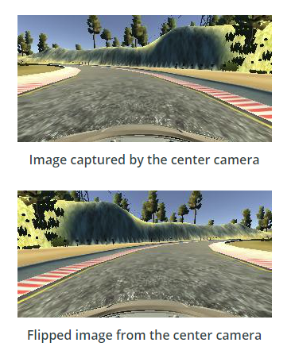
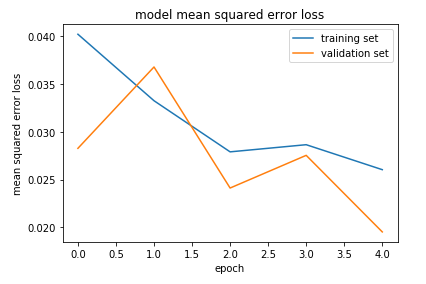

**Behavioral Cloning Project**

The goals / steps of this project are the following:
* Use the simulator to collect data of good driving behavior
* Build, a convolution neural network in Keras that predicts steering angles from images
* Train and validate the model with a training and validation set
* Test that the model successfully drives around track one without leaving the road
* Summarize the results with a written report

My complete project code with results for individual steps can be found [here](./Behavioral-Cloning/blob/master/model.ipynb)

## Rubric Points
### Here I will consider the [rubric points](https://review.udacity.com/#!/rubrics/432/view) individually and describe how I addressed each point in my implementation.  

---
### Files Submitted & Code Quality

#### 1. Submission includes all required files and can be used to run the simulator in autonomous mode

My project includes the following files:
* model.py containing the script to create and train the model
* drive.py for driving the car in autonomous mode
* model.h5 containing a trained convolution neural network 
* README.md summarizing the results

#### 2. Submission includes functional code
Using the Udacity provided simulator and my drive.py file, the car can be driven autonomously around the track by executing 
```sh
python drive.py model.h5
```

#### 3. Submission code is usable and readable

The model.py/ model.ipynb file contains the code for training and saving the convolution neural network. The file shows the pipeline I used for training and validating the model, and it contains comments to explain how the code works.

### Model Architecture and Training Strategy

#### 1. An appropriate model architecture has been employed

My model uses NVIDIA architecure that consists of Normalization layer, 5 convolution layers and 4 fully connected layers as shown below:

The model includes RELU layers to introduce nonlinearity, and the data is normalized in the model using a Keras lambda layer. I also used Keras Cropping2D function to crop input images simultaneously when making predictions.

#### 2. Attempts to reduce overfitting in the model

The model was trained and validated on different data sets to ensure that the model was not overfitting. The model was tested by running it through the simulator and ensuring that the vehicle could stay on the track. I decided not to modify the model by applying regularization techniques like Dropout or Max pooling as the model was already performing well. 

#### 3. Model parameter tuning

The model used an adam optimizer, so the learning rate was not tuned manually.

#### 4. Appropriate training data

Training data was chosen to keep the vehicle driving on the road. I used a combination of 2 laps of center lane driving,1 lap of recover driving from sides and 1 lap of smooth driving around curves. 

For details about how I created the training data, see the next section. 

### Model Architecture and Training Strategy

#### 1. Solution Design Approach

My first step was to use a LeNet architecture, but the car went off the track. A Lambda layer was introduced to normalize the input images to zero means. This step allows the car to move a bit further, but it didn't get to the first turn. Another Cropping layer was introduced, and the first turn was almost there, but not quite.

So I used an even more powerful network designed by [NVIDIA](https://devblogs.nvidia.com/deep-learning-self-driving-cars/). This time the car did drive better, but it still not able to get through the curves. I have collected more data. Augmented the data by adding the same image flipped with a negative angle. In addition to that, the left and right camera images were introduced with a correction factor on the angle to help the car drive back to the center. 

In order to gauge how well the model was working, I split my image and steering angle data into a training and validation set. At the end of the process, the vehicle is able to drive autonomously around the track without leaving the road.

#### 2. Final Model Architecture

My model uses NVIDIA architecure that consists of Normalization layer, 5 convolution layers and 4 fully connected layers as shown below:


#### 3. Creation of the Training Set & Training Process

To capture good driving behavior, I have captured 2 laps of center lane driving,1 lap of recover driving from sides and 1 lap of smooth driving around curves. 

To augment the data sat, I also flipped images and angles thinking that this would help with the left turn bias For example, here is an image that has then been flipped:



I finally randomly shuffled the data set and put 80% of the data into training set and 20% of the data into a validation set. 

I used this training data for training the model. The validation set helped determine if the model was over or under fitting. The ideal number of epochs was 5 as evidenced. I used an adam optimizer so that manually training the learning rate wasn't necessary.

I used generators to help preprocess large amounts of data. This really helped me saved lot of time testing on large data set.

Finally, I used model.fit_generator to output a history object that contains the training and validation loss for each epoch. Here is the visualization of the loss




